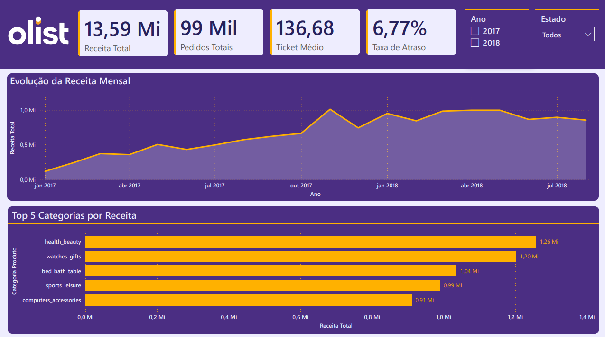
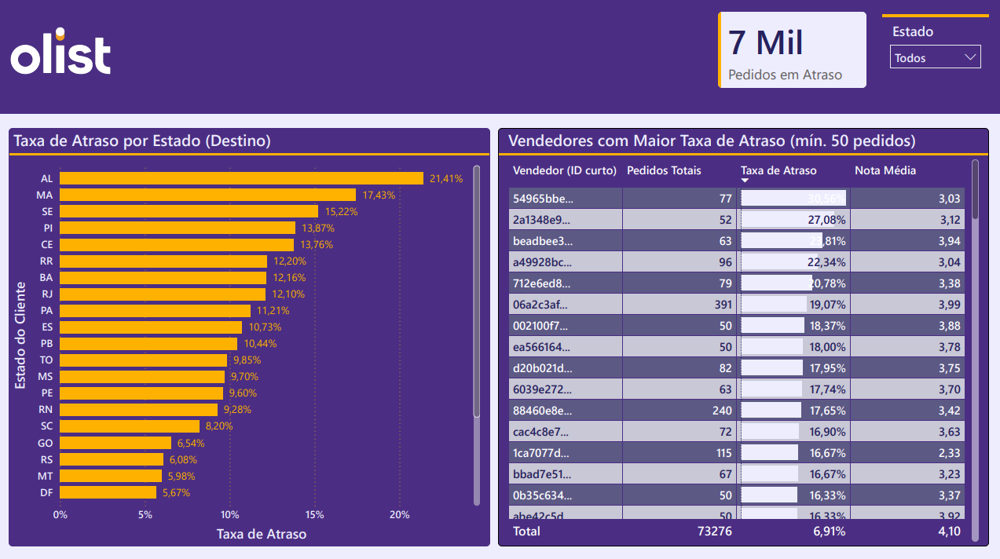
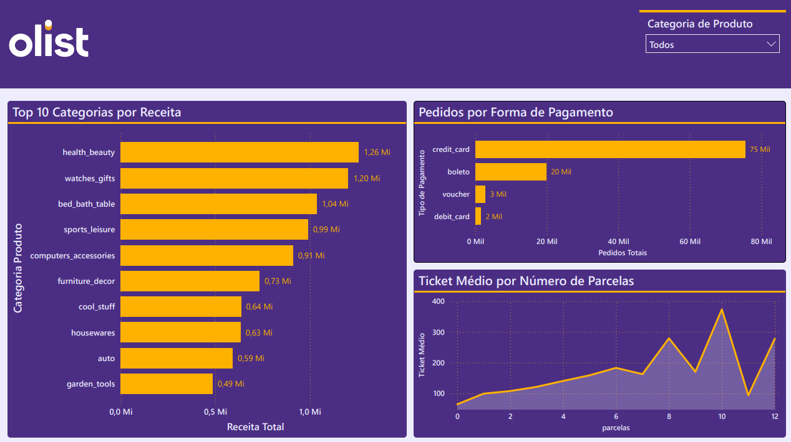

# 📊 Análise de E-commerce Brasileiro — Olist

Projeto completo de engenharia e análise de dados utilizando o dataset público da Olist (e-commerce brasileiro, 2016-2018). O projeto cobre todo o pipeline: ingestão, limpeza e tratamento de dados, análise exploratória com Python, modelagem dimensional (Star Schema) e dashboard interativo no Power BI.

---

## 🎯 Sobre o Projeto

A Olist é um marketplace que conecta pequenos vendedores a grandes canais de venda no Brasil. Este projeto analisa cerca de **100 mil pedidos reais** para responder perguntas estratégicas sobre logística, satisfação do cliente, performance de vendedores, receita por categoria e comportamento de pagamento — entregando os resultados em um dashboard executivo no Power BI.

**Persona do dashboard:** Gerente de Operações e Logística, que precisa monitorar entregas, identificar vendedores problemáticos e regiões críticas. Uso secundário pelo time de Negócios, para entender categorias e sazonalidade de receita.

---

## ❓ Perguntas Analíticas Respondidas

1. Por que pedidos atrasam? Quais regiões concentram o maior índice de atraso?
2. Atrasos na entrega realmente derrubam a nota de avaliação do cliente?
3. Existe sazonalidade nas vendas? Quais meses vendem mais?
4. Quais vendedores concentram mais atrasos e avaliações ruins?
5. Quais categorias de produto geram mais receita?
6. O custo do frete é desproporcional em alguma região?
7. Qual forma de pagamento domina? O parcelamento influencia o valor do pedido?
8. Como as vendas se distribuem geograficamente pelo Brasil?

---

## 💡 Principais Insights

**1. Atraso é um problema concentrado, mas com dois perfis diferentes.** A taxa nacional de atraso é de **6,8%**, mas Alagoas (AL) chega a **21,4%** — mais que o triplo da média. Por outro lado, São Paulo tem a menor taxa proporcional (4,5%), porém gera o **maior volume absoluto de pedidos atrasados do país (1.820)**, sendo o maior gerador de chamados no call center.

**2. Pontualidade é o principal fator de satisfação.** A nota média cai de **4,29 (no prazo) para 2,27 (atrasado)** — uma queda de 2 pontos inteiros. Pedidos atrasados geraram **3.432 avaliações nota 1**. Mais revelador ainda: **nenhum vendedor com mais de 50 vendas que entrega no prazo tem nota abaixo de 3,0** — pontualidade é condição suficiente para satisfação mínima.

**3. Crescimento saudável e sustentável.** O volume de pedidos cresceu de ~800/mês (jan/2017) para um pico de ~7.500/mês (nov/2017), enquanto o **ticket médio se manteve estável em torno de R$ 130-140**. O crescimento não foi "comprado" via descontos agressivos.

**4. Apenas 2 vendedores concentram o problema crítico.** Segmentando vendedores profissionais (50+ vendas) em uma matriz de risco: **250 são "Parceiros Gold"** (no prazo + nota alta), **167 estão na "Exceção Logística"** (atrasam mas mantêm nota alta — bom produto, logística ruim), e apenas **2 são "Ofensores Críticos"** (atraso sistemático + nota baixa). Suspender esses 2 vendedores resolve uma fonte massiva de insatisfação sem afetar a base saudável.

**5. Portfólio diversificado.** `health_beauty` lidera em receita (R$ 1,26 Mi), seguido por `watches_gifts` (R$ 1,20 Mi), `bed_bath_table` (R$ 1,04 Mi), `sports_leisure` (R$ 0,99 Mi) e `computers_accessories` (R$ 0,91 Mi). A Olist não depende de uma categoria única.

**6. Frete penaliza desproporcionalmente o Norte/Nordeste.** Em Roraima (RR), o frete representa **28,5% do valor do produto**, contra **13,8% em São Paulo** — quase o dobro. Essa diferença está correlacionada com o menor volume de pedidos nessas regiões (correlação, não necessariamente causalidade).

**7. Cartão de crédito domina, com forte cultura de parcelamento.** **73% das transações** são em cartão de crédito. Existe relação clara entre número de parcelas e valor do pedido (de R$ 96 em 1x até R$ 210 em 6x), com um pico expressivo em **10x** (ticket médio de R$ 415, 5.328 transações) — comportamento típico de promoções "10x sem juros" no varejo brasileiro.

**8. Concentração geográfica clássica (Pareto).** **SP, RJ e MG concentram 66,6%** de todos os pedidos. Seis estados juntos (SP, RJ, MG, RS, PR, SC) já passam de **80%** do volume total. Os mesmos estados que mais vendem são os que têm menor taxa de atraso e menor peso de frete — reforçando que infraestrutura logística e volume de mercado caminham juntos.

---

## 🛠️ Tecnologias Utilizadas

| Etapa | Ferramentas |
|---|---|
| Ingestão e limpeza | Python, Pandas, NumPy |
| Análise exploratória | Matplotlib, Seaborn |
| Armazenamento intermediário | Apache Parquet |
| Modelagem dimensional | Star Schema (fato + dimensões), DAX |
| Visualização | Power BI Desktop |
| Versionamento | Git / GitHub |

---

## 📁 Estrutura do Repositório

```
olist-ecommerce-analysis/
│
├── data/
│   ├── raw/              # CSVs originais (não versionados)
│   ├── processed/        # Dados limpos em Parquet (não versionados)
│   └── output/           # Tabelas do modelo estrela para o Power BI (não versionados)
│
├── notebooks/
│   ├── 01_eda_inicial.ipynb
│   ├── 02_limpeza_transformacao.ipynb
│   ├── 03_analise_exploratoria.ipynb
│   └── 04_modelagem_para_bi.ipynb
│
├── powerbi/
│   └── olist_dashboard.pbix
│
├── docs/
│   ├── dicionario_de_dados.md
│   ├── relatorio_qualidade_dados.md
│   └── prints/           # Capturas de tela do dashboard
│
├── .gitignore
└── README.md
```

---

## 📈 Dashboard

O dashboard é composto por **3 páginas**:

**Visão Executiva** — KPIs principais (Receita Total, Pedidos Totais, Ticket Médio, Taxa de Atraso), evolução mensal da receita e Top 5 categorias por receita.

**Operações e Logística** — Taxa de atraso por estado, e tabela com os vendedores de maior risco (taxa de atraso e nota média).

**Produtos e Pagamentos** — Top 10 categorias por receita, distribuição por forma de pagamento e ticket médio por número de parcelas.

 





---

## 🚀 Como Executar o Projeto

1. Clone este repositório
2. Baixe o [dataset da Olist no Kaggle](https://www.kaggle.com/datasets/olistbr/brazilian-ecommerce) e coloque os arquivos CSV em `data/raw/`
3. Crie um ambiente virtual e instale as dependências:
   ```bash
   python -m venv venv
   source venv/bin/activate  # Windows: venv\Scripts\activate
   pip install pandas numpy matplotlib seaborn jupyter pyarrow scikit-learn
   ```
4. Execute os notebooks em ordem (01 → 04)
5. Abra `powerbi/olist_dashboard.pbix` no Power BI Desktop e clique em **Atualizar**

---

## 👤 Autor - Maria Luiza Pereto 

Projeto desenvolvido como parte de um portfólio de Engenharia e Análise de Dados.